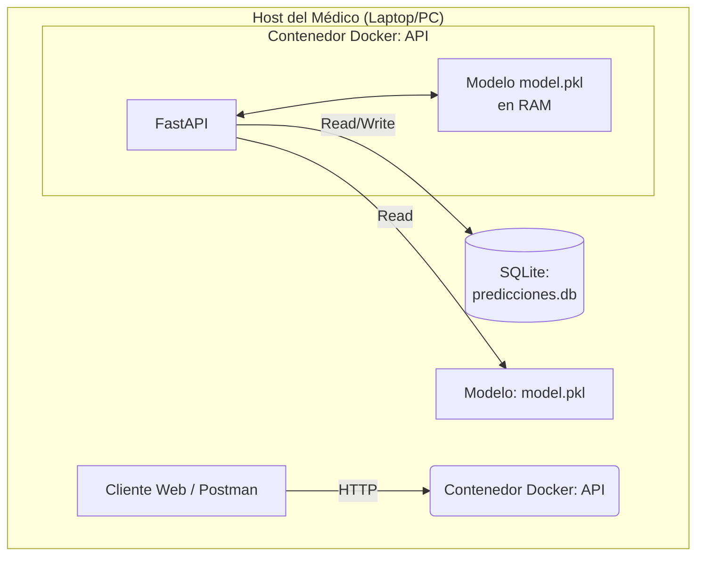
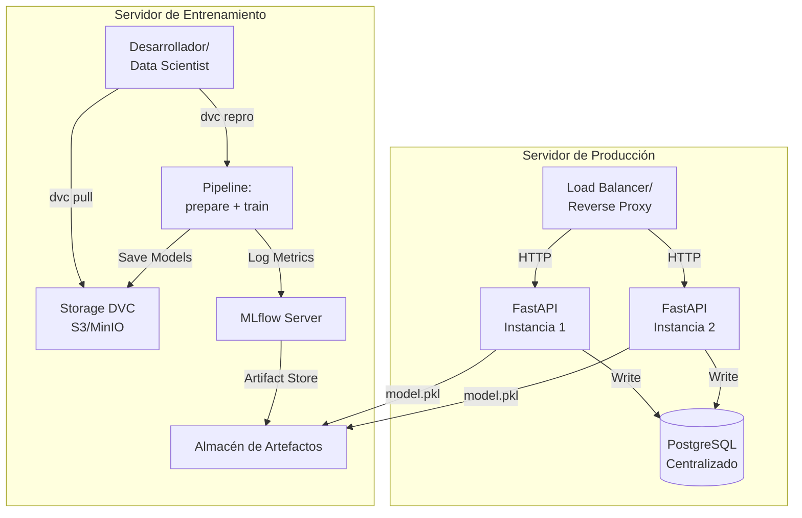
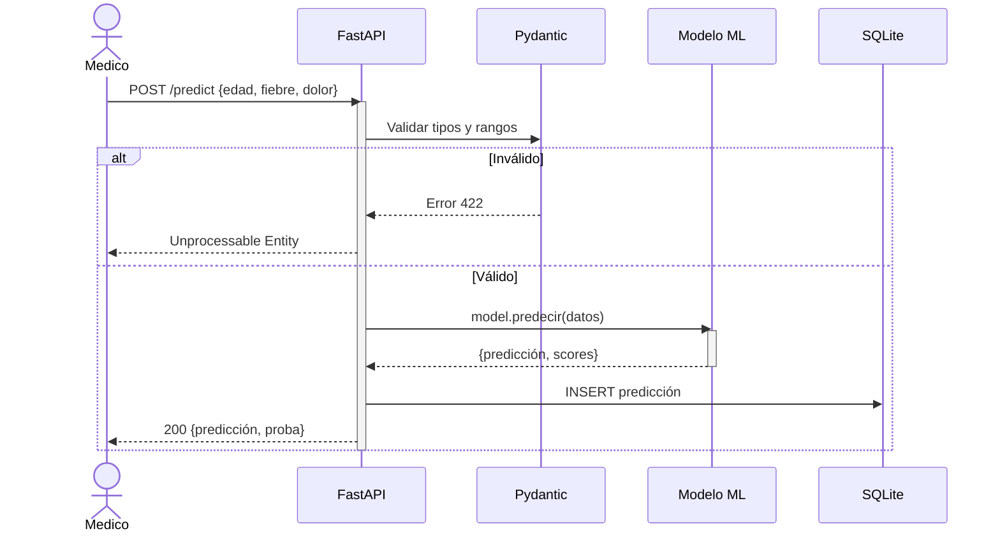
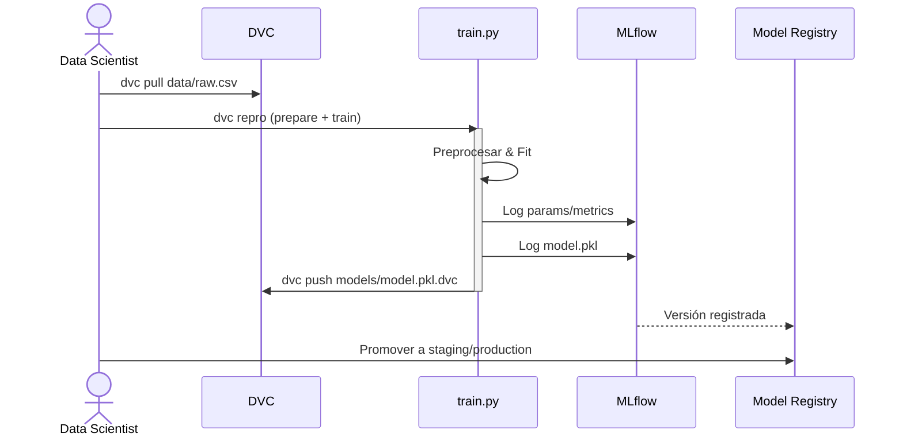

# API Médica - Pipeline MLOps Nivel 2

## Descripción

Este proyecto implementa una **arquitectura MLOps** para un modelo de predicción médica, integrando **DVC** para versionado de datos/modelos, **MLflow** para seguimiento de experimentos, **FastAPI** con validación Pydantic, **SQLAlchemy ORM** con SQLite para persistencia, **Docker Compose** para orquestación y **pruebas end-to-end**.

El servicio predice el diagnóstico de un paciente según: **edad**, **fiebre** y **nivel de dolor**, con dos escenarios de uso:
- **Local (Médico)**: API ligera en consultorio con SQLite
- **Servidor (MLOps)**: Infraestructura centralizada con DVC, MLflow, reentrenamiento automático

**Características principales**:
- **Pipeline reproducible con DVC**: `dvc repro` garantiza reproducibilidad
- **Seguimiento de experimentos con MLflow**: Logging de parámetros, métricas y artefactos
- **API FastAPI con Pydantic**: Validación robusta de entrada, Swagger docs
- **Persistencia SQLite + SQLAlchemy**: ORM para gestión de predicciones (historial)
- **Versionado de modelos con joblib**: Artefacto `models/model.pkl` rastreado por DVC
- **Docker Compose**: API (puerto 8000) + MLflow UI (puerto 5000)
- **Análisis Exploratorio (EDA)**: Gráficos, estadísticas y preprocesamiento
- **Pruebas E2E**: `pytest` con cobertura end-to-end
- **Inicio automático**: `./run_pipeline.sh` ejecuta: dvc pull → dvc repro → docker up

## Estructura del Proyecto

```
.
├── docs/
│   ├── PROPUESTA_ARQUITECTURA.md  # Arquitectura MLOps Nivel 2 (diagramas, migración)
│   └── adr/                       # Architectural Decision Records
│       ├── 0001-adopcion-dvc.md
│       ├── 0002-adopcion-mlflow.md
│       ├── 0003-persistencia-sqlite.md
│       └── 0004-fastapi-sqlite.md
├── README.md                      # Este archivo
└── modelo_medico/                 # Proyecto principal
    ├── app.py                     # API FastAPI (predict, predictions)
    ├── train.py                   # Entrenamiento + MLflow logging
    ├── eda.py                     # Análisis exploratorio
    ├── dvc.yaml                   # Pipeline reproducible (prepare → train)
    ├── params.yaml                # Hiperparámetros y configuración
    ├── dvc.lock                   # Bloqueo de reproducibilidad
    ├── docker-compose.yml         # Orquestación (API:8000, MLflow:5000)
    ├── Dockerfile                 # Imagen Docker multifunción
    ├── run_pipeline.sh            # Script: pull → repro → docker up
    ├── test_pipeline.py           # Pruebas E2E con pytest
    ├── requirements.txt           # DVC, MLflow, FastAPI, SQLAlchemy, joblib
    ├── src/
    │   ├── __init__.py
    │   ├── prepare.py             # Preprocesamiento (etapa DVC)
    │   ├── model.py               # Modelo ML con predicciones
    │   ├── model_utils.py         # Load/save model con joblib
    │   ├── preprocessor.py        # Normalización de datos
    │   ├── db.py                  # SQLAlchemy: engine, SessionLocal
    │   ├── models_db.py           # Esquema Prediccion (ORM)
    │   ├── schemas.py             # Pydantic: PatientInput, PredictionResponse
    │   ├── validator.py           # Validación de entrada
    │   ├── metrics.py             # Cálculo de métricas
    │   ├── estadisticas.py        # Estadísticas de predicciones
    │   └── __pycache__/
    ├── data/
    │   ├── raw.csv                # Datos brutos (rastreados por DVC)
    │   ├── raw.csv.dvc            # Metadatos DVC
    │   └── processed.parquet      # Datos procesados (salida etapa prepare)
    ├── models/
    │   ├── model.pkl              # Modelo entrenado (rastreado por DVC)
    │   └── model.pkl.dvc          # Metadatos DVC
    ├── mlruns/                    # Datos y artefactos de MLflow
    │   └── models/                # Modelos registrados
    ├── scripts/
    │   └── generate_raw_data.py   # Generación de datos sintéticos
    └── predicciones.db            # Base de datos SQLite (historial)
```

## Arquitectura MLOps Nivel 2

### Escenario Local (Consultorio Médico)
Arquitectura simplificada para uso en consultorio sin dependencias externas.



### Escenario Servidor (Infraestructura MLOps)
Arquitectura centralizada con versionado, tracking y reentrenamiento.



### Flujo de Predicción (Inferencia)



### Flujo de Entrenamiento y Versionado



## API REST - Endpoints

### Endpoint: POST /predict
Predice la enfermedad basado en síntomas del paciente.

**Request**:
```json
{
  "edad": 45.0,
  "fiebre": 39.5,
  "dolor": 8.0
}
```

**Response** (200):
```json
{
  "prediccion": "ENFERMEDAD CRÓNICA",
  "probabilidad": 0.82,
  "timestamp": "2025-11-20T10:30:45.123456",
  "entrada": {
    "edad": 45.0,
    "fiebre": 39.5,
    "dolor": 8.0
  }
}
```

**Validaciones**:
- `edad`: 0-150 años (float)
- `fiebre`: 35-45°C (float)
- `dolor`: 0-10 (float)

### Endpoint: GET /predictions
Obtiene el historial de predicciones almacenadas en SQLite.

**Response** (200):
```json
{
  "total": 15,
  "predicciones": [
    {
      "id": 1,
      "entrada": {"edad": 45.0, "fiebre": 39.5, "dolor": 8.0},
      "prediccion": "ENFERMEDAD CRÓNICA",
      "probabilidad": 0.82,
      "timestamp": "2025-11-20T10:30:45.123456"
    }
  ]
}
```

### Endpoint: GET /
Status check de la API.

**Response** (200):
```json
{
  "mensaje": "API de predicción médica",
  "version": "1.0",
  "uso": "POST /predict con JSON {'edad': float, 'fiebre': float, 'dolor': float}"
}
```

### Códigos de Error
- `400`: Faltan campos requeridos o datos inválidos
- `422`: Datos no validan contra el esquema Pydantic
- `500`: Error interno del servidor

## Instalación y Ejecución

### Requisitos
- **Python 3.11+**
- **Git**
- **Docker y Docker Compose**
- **DVC** (para versionado de datos/modelos)

### Opción 1: Inicio Rápido Automatizado

```bash
cd modelo_medico
pip install -r requirements.txt
./run_pipeline.sh
```

Esto ejecuta secuencialmente:
1. `dvc pull` → Descarga datos/modelos desde cache
2. `dvc repro` → Ejecuta pipeline (prepare → train)
3. `docker compose up --build` → Inicia API + MLflow UI

Acceso:
- **API Swagger**: http://localhost:8000/docs
- **MLflow UI**: http://localhost:5000

### Opción 2: Desarrollo Local Paso a Paso

#### 1. Clonar e instalar dependencias
```bash
cd modelo_medico
pip install -r requirements.txt
```

#### 2. Descargar datos y modelos
```bash
dvc pull
```

#### 3. Ejecutar pipeline (reproducible)
```bash
dvc repro
# Outputs:
# - data/processed.parquet
# - models/model.pkl
# - mlruns/ (tracking MLflow)
```

#### 4. Iniciar API FastAPI
```bash
uvicorn app:app --reload --port 8000
```

Acceso: http://localhost:8000/docs

#### 5. Iniciar MLflow UI (en otra terminal)
```bash
mlflow ui --backend-store-uri ./mlruns --port 5000
```

Acceso: http://localhost:5000

#### 6. Probar predicciones
```bash
curl -X POST "http://localhost:8000/predict" \
  -H "Content-Type: application/json" \
  -d '{"edad": 45.0, "fiebre": 39.5, "dolor": 8.0}'

curl "http://localhost:8000/predictions"
```

#### 7. Ejecutar pruebas
```bash
pytest test_pipeline.py -v --cov=src
```

#### 8. Análisis Exploratorio (EDA)
```bash
python eda.py
```

### Opción 3: Docker Compose (Recomendado para Producción)

#### Construir e iniciar
```bash
docker compose up --build -d
```

#### Ver logs
```bash
docker compose logs -f api
docker compose logs -f mlflow
```

#### Detener
```bash
docker compose down
```

Acceso:
- **API**: http://localhost:8000/docs
- **MLflow**: http://localhost:5000

Volúmenes persistentes:
- `./data/` → Datos raw y procesados
- `./models/` → Modelo entrenado
- `./mlruns/` → Tracking MLflow
- `./predicciones.db` → Historial SQLite

## Testing de la API

### Con cURL

```bash
# Status de la API
curl http://localhost:8000/

# Realizar predicción
curl -X POST http://localhost:8000/predict \
  -H "Content-Type: application/json" \
  -d '{"edad": 45.0, "fiebre": 39.5, "dolor": 8.0}'

# Obtener historial de predicciones
curl http://localhost:8000/predictions
```

### Con Postman

1. **URL**: `http://localhost:8000/predict`
2. **Método**: POST
3. **Headers**: `Content-Type: application/json`
4. **Body** (JSON raw):
```json
{
  "edad": 45.0,
  "fiebre": 39.5,
  "dolor": 8.0
}
```

### Con Swagger UI

Accede a http://localhost:8000/docs para probar interactivamente todos los endpoints.

## Funcionalidades Principales

### 1. Pipeline Reproducible con DVC
- **Archivo `dvc.yaml`**: Define etapas (prepare, train) con inputs/outputs/params
- **Archivo `params.yaml`**: Hiperparámetros y configuración centralizada
- **Comando `dvc repro`**: Ejecuta pipeline de forma reproducible
- **Comando `dvc pull`**: Descarga datos/modelos desde cache
- **Bloqueo `dvc.lock`**: Garantiza reproducibilidad exacta

### 2. Seguimiento de Experimentos con MLflow
- **Logging automático**: Parámetros, métricas, modelos en cada entrenamiento
- **Interfaz web**: Comparar experimentos, métricas, artefactos
- **Artifact Store**: Almacenamiento centralizado de modelos
- **Model Registry**: Versionado y promoción de modelos (staging/production)

### 3. API FastAPI + Validación Pydantic
- **Endpoint `/predict`**: Predicciones en tiempo real con validación
- **Esquema `PatientInput`**: Validación de tipos y rangos automática
- **Respuesta `PredictionResponse`**: JSON tipado con probabilidad y timestamp
- **Documentación automática**: Swagger UI en `/docs`

### 4. Persistencia SQLite + SQLAlchemy ORM
- **Base de datos `predicciones.db`**: Almacena historial de predicciones
- **Tabla `Prediccion`**: Campos (id, entrada_json, prediccion, probabilidad, timestamp)
- **ORM SQLAlchemy**: Abstracción de BD, pronta migración a PostgreSQL
- **Sesiones async-ready**: Arquitectura preparada para concurrencia

### 5. Versionado de Modelos con joblib + DVC
- **Archivo `models/model.pkl`**: Modelo serializado con joblib
- **Metadato `models/model.pkl.dvc`**: Rastreado por DVC
- **Función `load_model()`**: Carga automática en la API
- **Historial Git + DVC**: Trazabilidad completa

### 6. Despliegue Docker Compose
- **Servicio `api`**: FastAPI en puerto 8000 con healthcheck
- **Servicio `mlflow`**: MLflow UI en puerto 5000
- **Volúmenes persistentes**: data/, models/, mlruns/, predicciones.db
- **Dockerfile multifunción**: Soporta API, entrenamiento, MLflow

### 7. Análisis Exploratorio (EDA)
- **Archivo `eda.py`**: Gráficos, correlaciones, distribuciones
- **Integración DVC**: `dvc pull` automático antes de analizar
- **Preprocesamiento**: Normalización, validación de datos

### 8. Pruebas End-to-End
- **Archivo `test_pipeline.py`**: Pytest con casos completos
- **Cobertura**: `pytest --cov=src`
- **Validación de flujos**: Desde datos brutos hasta predicción

## Stack Tecnológico

| Componente | Tecnología | Versión | Propósito |
|-----------|-----------|---------|----------|
| **Framework API** | FastAPI | 0.104+ | API REST con validación automática |
| **Validación** | Pydantic | 2.0+ | Esquemas de datos tipados |
| **ORM** | SQLAlchemy | 2.0+ | Abstracción de base de datos |
| **Base de Datos** | SQLite | - | Almacenamiento local de predicciones |
| **Servidor Web** | Uvicorn | 0.24+ | Servidor ASGI para FastAPI |
| **Versionado Datos** | DVC | 3.0+ | Control de versión de datos/modelos |
| **Tracking Experimentos** | MLflow | 2.0+ | Logging de parámetros/métricas/modelos |
| **Serialización Modelo** | joblib | 1.5+ | Persistencia de modelos Python |
| **Ciencia de Datos** | NumPy, Scikit-learn | 2.0+, 1.7+ | Cálculos y ML |
| **Testing** | pytest | 9.0+ | Pruebas unitarias y E2E |
| **Containerización** | Docker & Docker Compose | - | Orquestación de servicios |
| **Control de Versión** | Git | - | Versionado de código |

## Flujo de Trabajo Típico

### Para Data Scientists (Entrenamiento)

```bash
# 1. Actualizar datos
git pull
dvc pull

# 2. Modificar parámetros en params.yaml
nano modelo_medico/params.yaml

# 3. Reproducir pipeline
cd modelo_medico
dvc repro

# 4. Ver experimentos en MLflow UI
mlflow ui --backend-store-uri ./mlruns

# 5. Registrar nuevos artefactos
dvc push

# 6. Hacer commit en Git
git add dvc.lock params.yaml
git commit -m "Experimento: tuning hiperparámetros"
git push
```

### Para Médicos (Predicción)

```bash
# 1. Clonar e instalar
git clone <repo>
cd modelo_medico
pip install -r requirements.txt

# 2. Iniciar con un solo comando
./run_pipeline.sh
# Abre automáticamente http://localhost:8000/docs

# 3. Realizar predicción (via API o Swagger)
curl -X POST "http://localhost:8000/predict" \
  -H "Content-Type: application/json" \
  -d '{"edad": 45.0, "fiebre": 39.5, "dolor": 8.0}'

# 4. Ver historial en base de datos
sqlite3 predicciones.db "SELECT * FROM prediccion LIMIT 5;"
```

### Para DevOps (Producción)

```bash
# 1. Build y deploy con Docker Compose
docker compose up --build -d

# 2. Monitorear health checks
docker compose ps

# 3. Escalar si es necesario
docker compose up -d --scale api=3

# 4. Ver logs centralizados
docker compose logs -f

# 5. Migración a PostgreSQL (cuando crezca)
# Ver docs/PROPUESTA_ARQUITECTURA.md #3. Guía de Migración
```

## Decisiones Arquitectónicas

Documentadas en: **`docs/adr/`**

- **ADR-0001**: Adopción de DVC para versionado reproducible
- **ADR-0002**: Adopción de MLflow para tracking de experimentos
- **ADR-0003**: SQLite para persistencia local (con ruta a PostgreSQL)
- **ADR-0004**: FastAPI + SQLAlchemy para API robusta

## Troubleshooting

### Error: "ModuleNotFoundError: No module named 'dvc'"
```bash
# Instalar dependencias completas
pip install -r modelo_medico/requirements.txt
```

### Error: "predicciones.db permission denied"
```bash
# Cambiar permisos (Linux/Mac)
chmod 666 modelo_medico/predicciones.db
```

### Error: "Port 8000 already in use"
```bash
# Usar puerto diferente
uvicorn app:app --port 8001

# O terminar proceso en puerto 8000
lsof -ti:8000 | xargs kill -9
```

### Error: "DVC cache not found"
```bash
# Reconstruir cache local
cd modelo_medico
dvc pull --relink
```

### Error: "MLflow UI no responde"
```bash
# Reiniciar servicio MLflow
docker compose restart mlflow

# O iniciar manualmente
mlflow ui --backend-store-uri ./mlruns --port 5000
```

### Error: "Database is locked (SQLite)"
```bash
# Cerrar conexiones y limpiar locks
rm -f modelo_medico/predicciones.db-journal
docker compose restart api
```

## Documentación Adicional
 
- **Propuesta general del pipeline de MLOps y arquitectura completa**: Ver `docs/PROPUESTA_ARQUITECTURA.md`
- **Decisiones técnicas (ADRs)**: Ver `docs/adr/`
- **API Swagger**: http://localhost:8000/docs (en tiempo de ejecución)
- **MLflow UI**: http://localhost:5000 (en tiempo de ejecución)