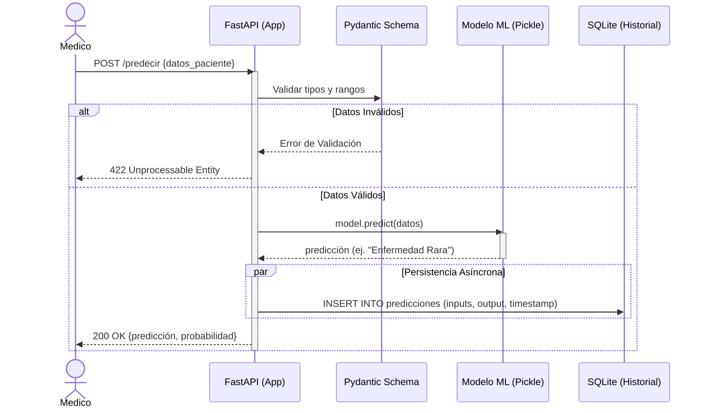
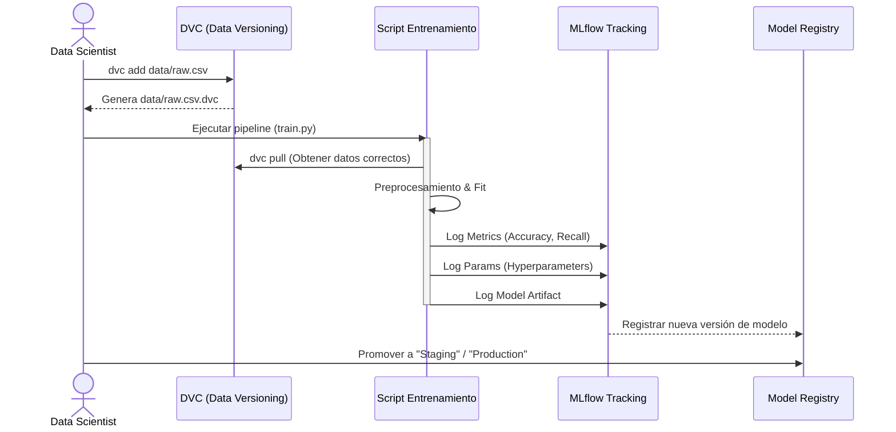
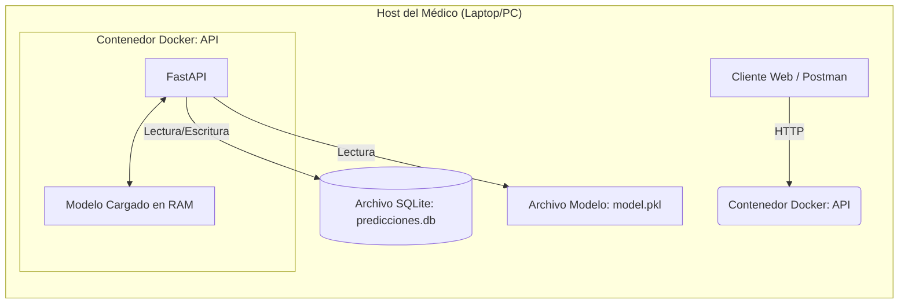

# Propuesta de Arquitectura MLOps - Nivel 2

Este documento detalla la arquitectura técnica para la implementación de DVC, MLflow, FastAPI y SQLite, cubriendo tanto el escenario de uso local (Médico) como el de servidor (MLOps/Entrenamiento).

## 1. Diagramas de Secuencia

### 1.1. Flujo de Predicción (Inferencia)
Este flujo describe cómo interactúa el médico con el sistema para obtener un diagnóstico.



### 1.2. Flujo de Entrenamiento y Versionado

Este flujo describe cómo el Data Scientist actualiza el modelo asegurando reproducibilidad.



## 2. Arquitectura de Despliegue

### 2.1. Escenario Local (Consultorio Médico)

Diseñado para simplicidad y bajos recursos. Todo corre en la máquina del médico o un servidor local pequeño.



### 2.2. Escenario Servidor (Infraestructura MLOps)
Diseñado para el equipo de ingeniería, reentrenamiento y monitoreo centralizado.

```mermaid
graph TD
    subgraph "Servidor de Entrenamiento & Monitoreo"
        A[Airflow / GitHub Actions] -->|Trigger| B[Job de Entrenamiento]
        B -->|Log| C[Servidor MLflow]
        B -->|Pull Data| D[Storage DVC (S3/MinIO)]
        C -->|Store Artifacts| E[Artifact Store]
    end
    
    subgraph "Servidor de Producción"
        F[Load Balancer] --> G[Instancia API 1]
        F --> H[Instancia API 2]
        G & H -->|Write| I[(PostgreSQL Centralizado)]
        G & H -->|Load| E
    end
```

## 3. Guía de Migración: SQLite a PostgreSQL
Si el volumen de datos crece o se requiere concurrencia alta, se sugiere migrar de SQLite a PostgreSQL.

### Pasos para la migración
1. Infraestructura: Añadir un servicio db (PostgreSQL) en el docker-compose.yml.
2. Dependencias: Instalar psycopg2-binary en requirements.txt.
3. Configuración (Variables de Entorno): Cambiar la DATABASE_URL en el archivo .env.
    - Antes: sqlite:///./predicciones.db
    - Después: postgresql://user:password@db:5432/mlops_db
4. Código (SQLAlchemy): Gracias al uso de SQLAlchemy (ORM), no es necesario cambiar el código de la aplicación. El ORM abstrae el dialecto SQL. Solo debe asegurarse que al iniciar la app se ejecute Base.metadata.create_all(bind=engine) para crear las tablas en Postgres automáticamente.
5. Migración de Datos (Opcional): Si se desean conservar los datos históricos de SQLite, es posible usar herramientas como pgloader o scripts de exportación CSV -> importación SQL.

