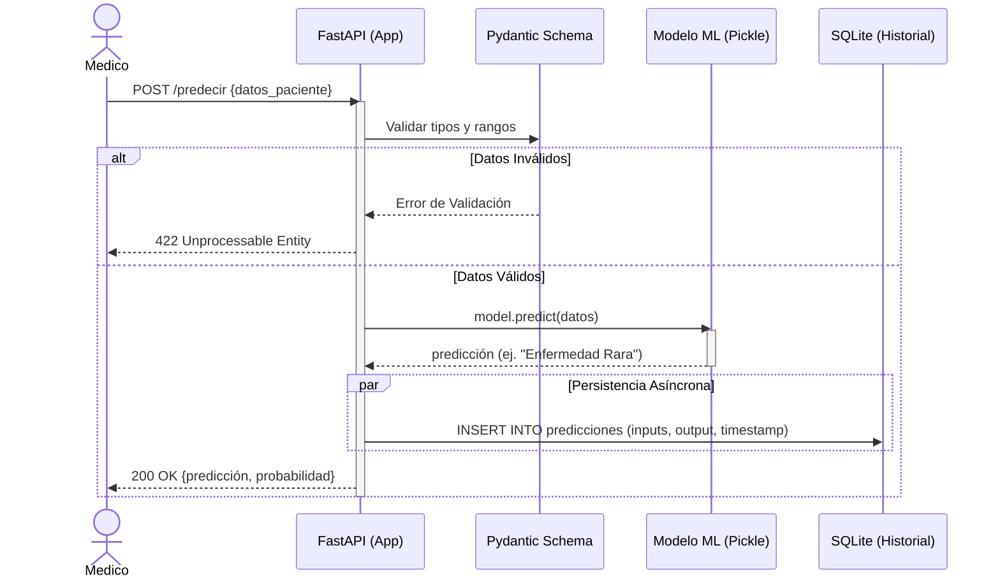
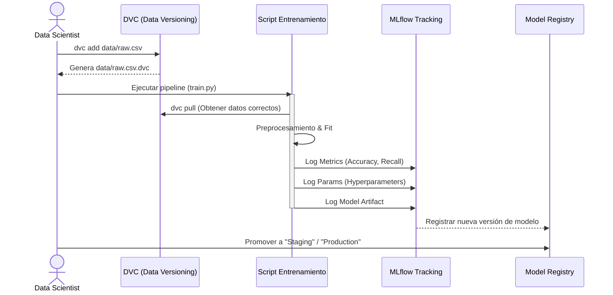
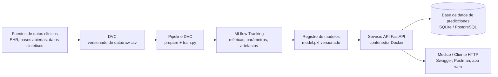
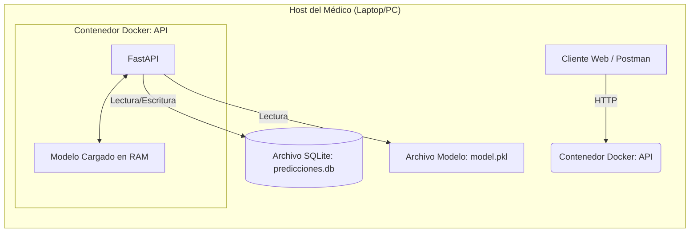
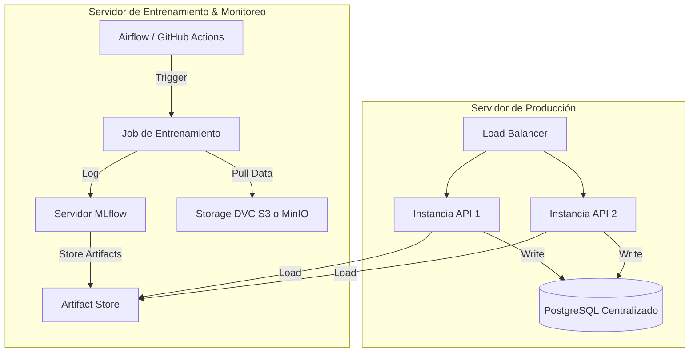

# Propuesta de Arquitectura MLOps - Nivel 2

Este documento detalla la **propuesta reestructurada del pipeline de MLOps** para el problema de predicción de enfermedades comunes y huérfanas. Es el documento principal de referencia para la arquitectura end-to-end del sistema y complementa la propuesta original de pipeline de ML descrita en [`pipeline.md`](pipeline.md:1).

La solución se basa en DVC, MLflow, FastAPI y SQLite/PostgreSQL, cubriendo tanto el escenario de uso local (Médico) como el de servidor (MLOps/Entrenamiento).

## 0. Suposiciones del problema y de la solución

### 0.1. Suposiciones sobre los datos

- Se dispone de un **conjunto de datos estructurado mínimo** con las variables:
  - Edad del paciente (años).
  - Temperatura corporal (fiebre, en °C).
  - Nivel de dolor en escala 0–10.
  - Etiqueta de diagnóstico (tipo de enfermedad).
- Los datos han sido **anonimizados** y cumplen con las políticas básicas de privacidad (no se almacenan identificadores directos como nombre, número de historia clínica, etc.).
- Para **enfermedades huérfanas** se asume que existe un número reducido de casos, por lo que se pueden necesitar:
  - Datos sintéticos o técnicas de balanceo de clases.
  - Métricas robustas que consideren el desbalance de clases.
- Se asume que la calidad de los datos es razonable (porcentaje de valores faltantes o erróneos bajo) y que existe un proceso previo mínimo de limpieza.

### 0.2. Suposiciones sobre la infraestructura

- El médico cuenta con un **equipo local** (laptop o PC) con capacidad para:
  - Ejecutar Python y las dependencias del proyecto, o
  - Ejecutar contenedores Docker (escenario recomendado).
- Para el escenario de **servidor/MLOps** se asume la existencia de:
  - Un almacenamiento remoto accesible por DVC (carpeta compartida, S3/MinIO, etc.).
  - Un servidor para ejecutar MLflow Tracking y almacenar artefactos.
  - Una infraestructura básica para desplegar la API (por ejemplo, Docker Compose o Kubernetes sencillo).
- La base de datos de predicciones comienza siendo **SQLite** (archivo local `predicciones.db`) y puede migrarse a **PostgreSQL** cuando crezca el volumen de datos o la concurrencia (ver guía de migración en la sección 3).

### 0.3. Suposiciones operativas y de uso

- El modelo se utiliza como **herramienta de apoyo a la decisión clínica**, no reemplaza el criterio médico ni constituye un diagnóstico definitivo.
- Se espera que el sistema entregue respuestas con **baja latencia** (segundos) para que sea usable en consulta.
- El equipo de datos/ML:
  - Reentrena el modelo de forma **periódica** cuando se incorporan nuevos datos.
  - Utiliza MLflow para comparar versiones y promover modelos a producción.
- Se asume que existe un **flujo básico de CI/CD** (por ejemplo, GitHub Actions) que:
  - Ejecuta pruebas automáticas.
  - Construye y publica imágenes de Docker actualizadas.

## 1. Diagramas de Secuencia

### 1.1. Flujo de Predicción (Inferencia)
Este flujo describe cómo interactúa el médico con el sistema para obtener un diagnóstico.

### 1.2. Flujo de Entrenamiento y Versionado

Este flujo describe cómo el Data Scientist actualiza el modelo asegurando reproducibilidad.

### 1.3. Diagrama principal del pipeline de MLOps (end-to-end)

El siguiente diagrama resume el flujo completo del pipeline de MLOps, desde la ingestión y versionado de datos hasta el despliegue del modelo y el consumo por parte del médico. Los diagramas posteriores (sección 2) profundizan en los escenarios de despliegue.

Este pipeline integra:

- **Gestión de datos y modelos** con DVC.
- **Entrenamiento y evaluación** con seguimiento en MLflow.
- **Despliegue** mediante FastAPI empaquetado en Docker.
- **Persistencia y monitoreo** de predicciones en una base de datos relacional.

## 2. Arquitectura de Despliegue

### 2.1. Escenario Local (Consultorio Médico)

Diseñado para simplicidad y bajos recursos. Todo corre en la máquina del médico o un servidor local pequeño.

### 2.2. Escenario Servidor (Infraestructura MLOps)
Diseñado para el equipo de ingeniería, reentrenamiento y monitoreo centralizado.

## 3. Guía de Migración: SQLite a PostgreSQL
Si el volumen de datos crece o se requiere concurrencia alta, se sugiere migrar de SQLite a PostgreSQL.

### Pasos para la migración
1. Infraestructura: Añadir un servicio db (PostgreSQL) en el docker-compose.yml.
2. Dependencias: Instalar psycopg2-binary en requirements.txt.
3. Configuración (Variables de Entorno): Cambiar la DATABASE_URL en el archivo .env.
    - Antes: `sqlite:///./predicciones.db`
    - Después: `postgresql://user:password@db:5432/mlops_db`
4. Código (SQLAlchemy): Gracias al uso de SQLAlchemy (ORM), no es necesario cambiar el código de la aplicación. El ORM abstrae el dialecto SQL. Solo debe asegurarse que al iniciar la app se ejecute Base.metadata.create_all(bind=engine) para crear las tablas en Postgres automáticamente.
5. Migración de Datos (Opcional): Si se desean conservar los datos históricos de SQLite, es posible usar herramientas como pgloader o scripts de exportación CSV -> importación SQL.

