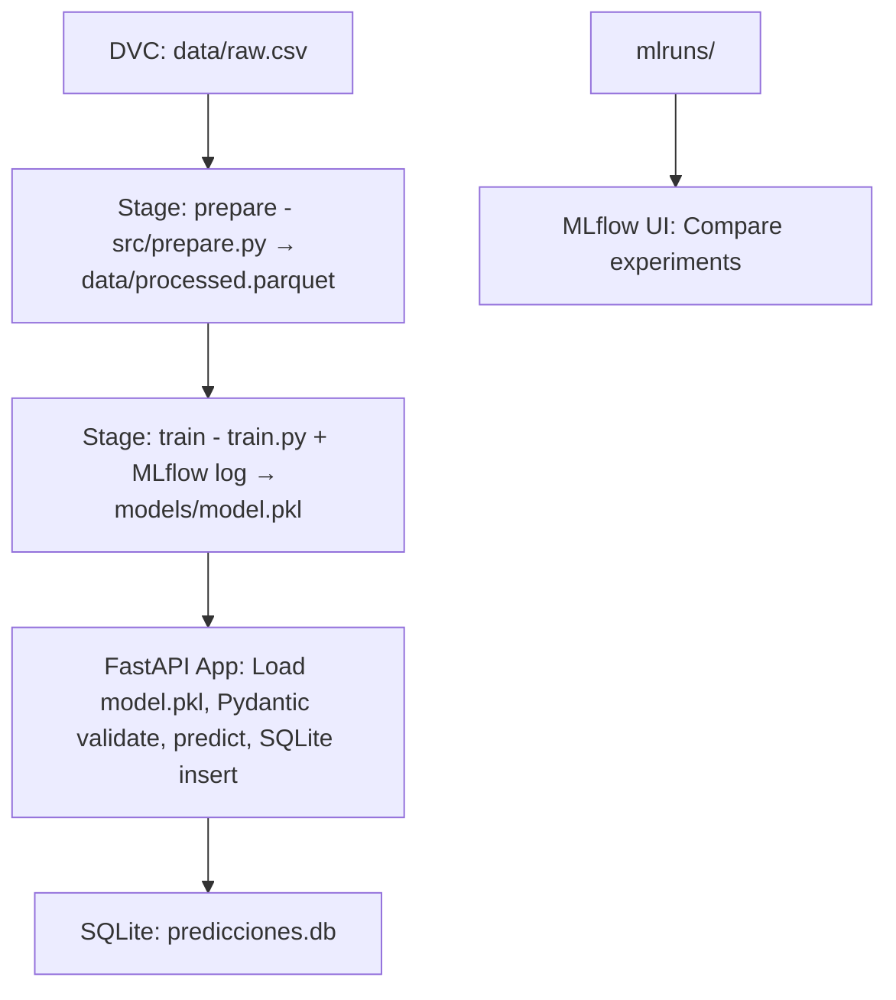

# Modelo Médico: MLOps Pipeline

[](https://dvc.org) [](https://mlflow.org) [](https://fastapi.tiangolo.com) [](https://www.docker.com/)

## Resumen

Implementación completa del pipeline MLOps con DVC, MLflow, FastAPI, SQLAlchemy (SQLite), Docker.

Ver [docs/IMPLEMENTATION_PLAN.md](../docs/IMPLEMENTATION_PLAN.md) para detalles de fases.

## Pipeline Overview


## Uso Rápido

1. **Ejecutar pipeline completo**:
   ```bash
   ./run_pipeline.sh
   ```

2. **Tests E2E** (dvc repro + MLflow + API + DB):
   ```bash
   pytest test_pipeline.py -v
   ```

3. **Servicios**:
   | Servicio | URL | Descripción |
   |----------|-----|-------------|
   | FastAPI | http://localhost:8000/docs | Swagger UI, POST /predict |
   | MLflow UI | http://localhost:5000 | Experiments & models |

4. **Verificación Manual**:
   ```bash
   # 1. Pipeline DVC
   dvc repro
   
   # 2. Test API
   curl -X POST "http://localhost:8000/predict" \
        -H "Content-Type: application/json" \
        -d '{"edad":50.0, "fiebre":38.5, "dolor":7.0}'
   
   # 3. Check DB populated
   sqlite3 predicciones.db "SELECT COUNT(*) FROM prediccion;"
   
   # 4. MLruns populated
   ls -la mlruns/0/
   ```

## Docker

`docker compose up --build`

- Volumes: data/, models/, mlruns/, predicciones.db
- Healthchecks: API ready.

## Estructura

```
modelo_medico/
├── dvc.yaml       # Pipeline stages
├── params.yaml    # Hyperparams
├── run_pipeline.sh # One-command start
├── app.py         # FastAPI
├── test_pipeline.py # E2E pytest
├── src/           # prepare.py, model_utils.py, db.py, schemas.py...
├── data/          # raw.csv, processed.parquet
├── models/        # model.pkl, predicciones.db
└── mlruns/        # MLflow tracking