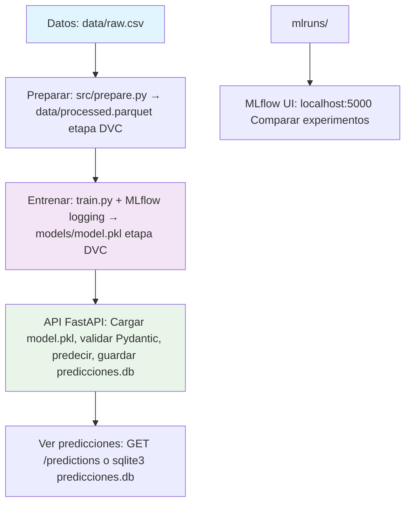

# Modelo Médico: Pipeline MLOps

[](https://dvc.org) [, **joblib** para versionado de modelos, **Docker Compose** para despliegue, pruebas end-to-end y EDA.

- **Rubrica alcanzada**: 5/5 (pipelines DVC, tracking MLflow, persistencia FastAPI+SQLite, despliegue Docker).
- **Refactor en 10 fases**: Ver [`docs/IMPLEMENTATION_PLAN.md`](../docs/IMPLEMENTATION_PLAN.md).

## Flujo de trabajo

Flujo de datos: `raw.csv` → preparar → entrenar (DVC/MLflow) → `model.pkl` → API predecir/guardar en BD → ver predicciones/UI MLflow.



## Funcionalidades implementadas

- **Pipeline reproducible con DVC**: etapas en `dvc.yaml` (`prepare`, `train`), `params.yaml`, `dvc pull/repro`.
- **Seguimiento de experimentos con MLflow**: Autolog de parámetros/métricas/modelos en `train.py`, artefactos en `mlruns/`, comparación en la UI.
- **API FastAPI**: `/predict` (POST JSON → predicción + inserción en BD), `/predictions` (GET lista), Pydantic `PatientInput`, ORM SQLAlchemy asíncrono.
- **Persistencia SQLite**: `predicciones.db` con tabla `Prediccion` (inputs, predicción, probabilidad, timestamp).
- **Versionado de modelos con Joblib**: artefacto `models/model.pkl`, cargado en la API.
- **Despliegue con Docker**: `docker-compose.yml` (API:8000, MLflow:5000), volúmenes persistentes.
- **Pruebas y EDA**: `pytest test_pipeline.py` (E2E), `eda.py` (DVC pull + gráficos).
- **Inicio con un solo comando**: `./run_pipeline.sh` (pull → repro → docker up).

## Configuración rápida

```bash
git clone <repo>
cd modelo_medico
pip install -r requirements.txt
dvc pull  # Cache de datos/modelos
```

## Desarrollo local

1. **Entrenar/Reproducir pipeline**:
   ```bash
   dvc repro  # prepare + train (crea data/processed.parquet, models/model.pkl, mlruns)
   # O con un solo comando:
   ./run_pipeline.sh
   ```

2. **Iniciar API**:
   ```bash
   uvicorn modelo_medico.app:app --reload --port 8000
   ```
   - Swagger: http://localhost:8000/docs

3. **Probar predicciones**:
   ```bash
   curl -X POST "http://localhost:8000/predict" \
     -H "Content-Type: application/json" \
     -d '{"edad": 50.0, "fiebre": 38.5, "dolor": 7.0}'

   curl "http://localhost:8000/predictions"
   ```

4. **MLflow UI**:
   ```bash
   mlflow ui --backend-store-uri ./mlruns --port 5000
   ```
   Abrir: http://localhost:5000

5. **Ejecutar pruebas**:
   ```bash
   pytest test_pipeline.py -v
   ```

6. **EDA**:
   ```bash
   python eda.py
   ```

## Despliegue con Docker

```bash
docker compose up --build --detach
```
- **API**: http://localhost:8000/docs (POST `/predict`, GET `/predictions`)
- **MLflow UI**: http://localhost:5000
- Volúmenes: `data/`, `models/`, `mlruns/`, `predicciones.db`

Healthchecks aseguran disponibilidad.

## Estructura del proyecto

```
modelo_medico/
├── app.py              # FastAPI (predict, predictions)
├── dvc.yaml            # Pipeline: prepare → train
├── params.yaml         # Hiperparámetros (samples, test_size)
├── requirements.txt    # mlflow, fastapi, sqlalchemy, dvc, ...
├── docker-compose.yml  # Servicios API + MLflow
├── run_pipeline.sh     # Un solo comando: pull → repro → docker up
├── train.py            # Entrenamiento ML + MLflow
├── eda.py              # Análisis exploratorio
├── test_pipeline.py    # Pytest E2E
├── src/                # prepare.py, db.py, schemas.py, model_utils.py, ...
├── data/               # raw.csv (.dvc), processed.parquet
├── models/             # model.pkl (.dvc), predicciones.db
└── mlruns/             # Datos de tracking MLflow
```